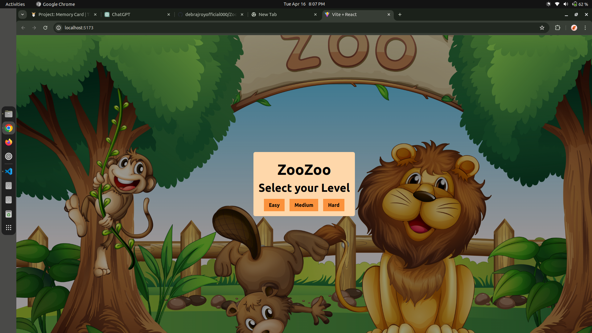
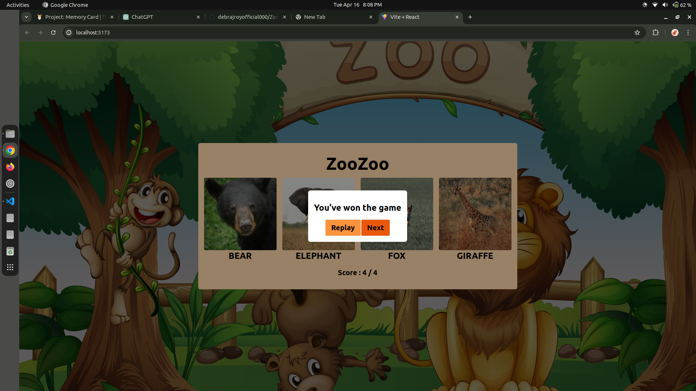
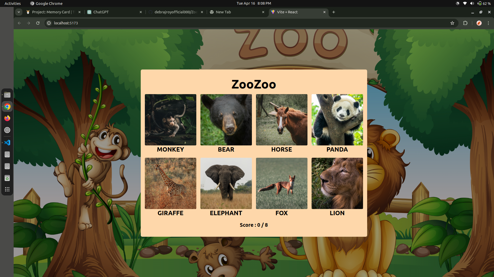

# ZooZoo - Memory Booster Game

Welcome to ZooZoo, a memory booster game built with React JS and Tailwind CSS for styling.

## Overview

ZooZoo is a fun and interactive game designed to improve your memory skills. The game presents players with various levels of difficulty - easy, medium, and hard. Upon selecting a level, players are presented with a grid of cards, each containing a unique image.

### How to Play

1. **Select Your Preferred Difficulty Level**: Choose between easy, medium, or hard.
2. **Click Any Card**: Click on any card, image attached to it.
3. **Memorize and Match**: Try to memorize the card's image and avoid clicking the same card again.
4. **Shuffle Cards**: After each click, all the cards will shuffle, keeping you on your toes!
5. **Continue Matching**: Keep clicking and matching pairs until you've uncovered all the cards.
6. **Complete Level**: If you manage to click on each card only once, a pop-up will appear, allowing you to either replay the game or advance to the next level.
7. **Final Level Finish**: Upon completing the final level, you can restart the game to challenge yourself again.

## Game Rules

- If you match all pairs, you advance to the next level.
- If you fail to match a pair, the game resets, and you must start from level 1.
- Each level increases in difficulty with more cards to match.

## Installation

To run ZooZoo locally, follow these steps:

1. Clone the repository: `git clone https://github.com/debrajroyofficial000/ZooZoo.git`
2. Navigate to the project directory: `cd ZooZoo`
3. Install dependencies: `npm install`
4. Start the development server: `npm run dev`

## Technologies Used

- React JS
- Tailwind CSS

## Sample Images

---

Enjoy playing ZooZoo and have fun improving your memory skills! If you have any questions or feedback, feel free to reach out.
